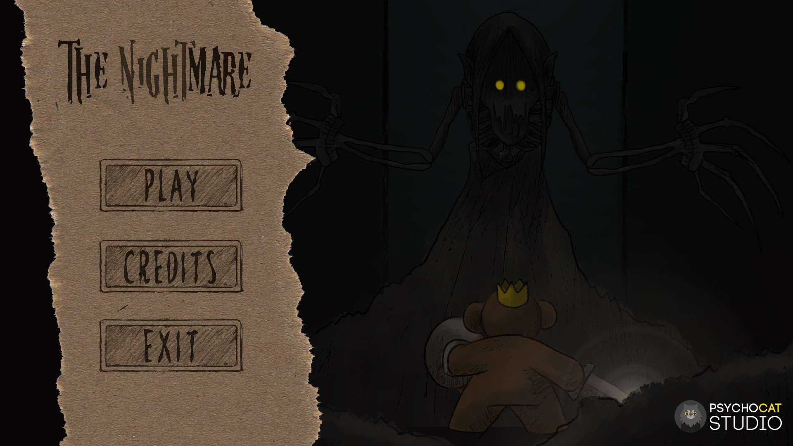
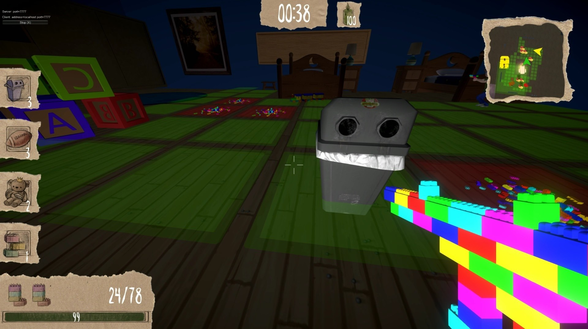
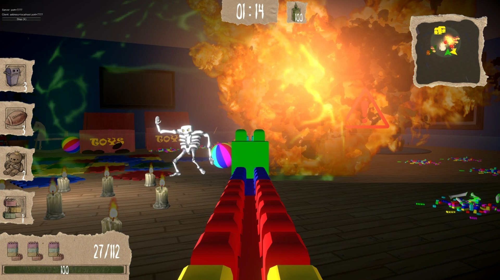
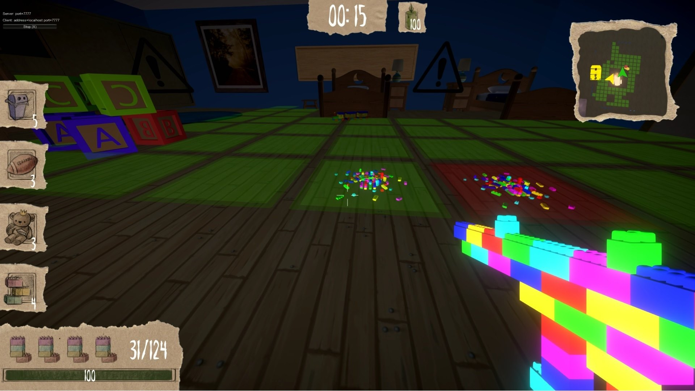

# The Nightmare
FPS multiplayer game. ZTGK (2019)
</br>
<p align="center">
  
  
  
  
</p>

### About game
The siblings wake up in the nightmare that takes place in the astral version of their home. To get out of it, they have to work together in a fight against the monsters that emerge from the darkness. Children know that monsters will attack at midnight. They have to find the right toys and prepare their home to fight them. Any nightmare can be controlled, so they use their imagination to turn their toys into weapons. Children will only get out of the nightmare if they keep the light on in their rooms.

### Trailer
https://vimeo.com/344669557

### Download
All releases of the game are avaliable on the github page in the [releases](https://github.com/msuliborski/the-nightmare/releases) tab. 

## Getting Started
These instructions will get you a copy of the project up and running on your local machine for development and testing purposes.

### Cloning
```
$ git clone https://github.com/msuliborski/the-nightmare
```

### Building
Using Unity Game Engine import project and hit play button. It should do everything automatically and let you run the game.

## Built with
* [Unity](https://unity.com/) - The world’s leading real-time creation platform

## Authors
* **Michał Suliborski** - [msuliborski](https://github.com/msuliborski)
* **Jędrzej Szor** - [jedrekszor](https://github.com/jedrekszor)
* **Michał Kuśmidrowicz** - [ninjarlz](https://github.com/ninjarlz)
* **Olga Kardas** - [OlgaKar](https://github.com/OlgaKar)
* **Adam Sabela** - [Drazzi0](https://github.com/Drazzi0)

## License
This project is licensed under the MIT License - see the [LICENSE.md](LICENSE.md) file for details
